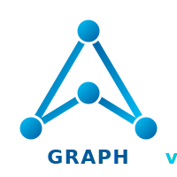

<table><tr>
<td></td>
<td>

# graph-v3 Documentation

> A modern C++20 graph library — 13 algorithms, 7 lazy views, 3 containers, 4261+ tests.

</td>
</tr></table>

---

## For Users

- [Getting Started](getting-started.md) — installation, first graph, first algorithm
- [Adjacency Lists](user-guide/adjacency-lists.md) — range-of-ranges model, concepts, CPOs
- [Edge Lists](user-guide/edge-lists.md) — flat sourced-edge model, concepts, patterns
- [Containers](user-guide/containers.md) — `dynamic_graph`, `compressed_graph`, `undirected_adjacency_list`, 27 trait combinations
- [Views](user-guide/views.md) — lazy traversal views (BFS, DFS, topological sort, etc.)
- [Algorithms](user-guide/algorithms.md) — Dijkstra, Bellman-Ford, MST, connected components, and more

## Reference

- [Adjacency List Interface](reference/adjacency-list-interface.md) — GCI spec for adjacency lists
- [Edge List Interface](reference/edge-list-interface.md) — GCI spec for edge lists
- [Concepts](reference/concepts.md) — all graph concepts in one place
- [CPO Reference](reference/cpo-reference.md) — CPO signatures and behavior
- [Algorithm Complexity](reference/algorithm-complexity.md) — time/space cheat sheet
- [Edge Value Concepts](reference/edge-value-concepts.md) — edge value type concepts
- [Vertex Patterns](reference/vertex-patterns.md) — inner value and storage patterns
- [Type Aliases](reference/type-aliases.md) — collected type alias reference

## For Contributors

- [Architecture](contributing/architecture.md) — design principles, directory structure, range-of-ranges model
- [Coding Guidelines](contributing/coding-guidelines.md) — naming, style, conventions
- [CPO Implementation Guide](contributing/cpo-implementation.md) — how to add a new CPO
- [CPO Order](contributing/cpo-order.md) — implementation priority and dependency order
- [Algorithm Template](contributing/algorithm-template.md) — template for new algorithm docs
- [View Template](contributing/view-template.md) — template for new view docs
- [View Chaining](contributing/view-chaining.md) — how view chaining works (and the solution to its limitations)

## Other

- [FAQ](FAQ.md) — common questions and answers
- [Migration from v2](migration-from-v2.md) — what changed from graph-v2 and how to migrate
- [Status & Metrics](status/metrics.md) — canonical counts and implementation matrix
- [Code Coverage](status/coverage.md) — line and function coverage report (95.8% lines, 92.0% functions)
