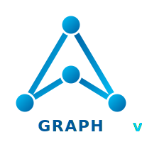
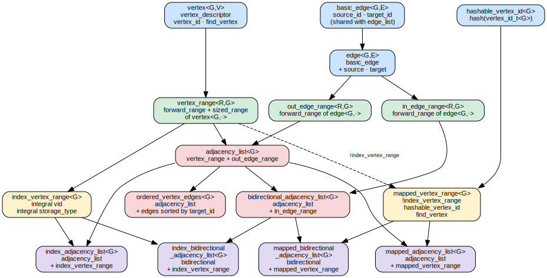
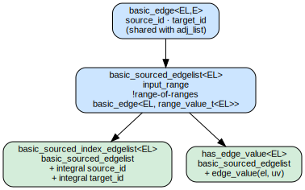

<table><tr>
<td></td>
<td>

# Concepts Reference


> All graph concepts live in `namespace graph::adj_list` (adjacency lists) or
`namespace graph::edge_list` (edge lists) and are re-exported into
`namespace graph` via `<graph/graph.hpp>`.

</td>
</tr></table>

> [← Back to Documentation Index](../index.md) · [CPO Reference](cpo-reference.md)

---

## Adjacency List Concepts

Header: `<graph/adj_list/adjacency_list_concepts.hpp>`

### Concept Hierarchy

```
Primitives
  edge<G, E>  ·  vertex<G, V>  ·  hashable_vertex_id<G>

Ranges  (parameterised on a range type R)
  out_edge_range<R, G>          requires edge<G, E>
  in_edge_range<R, G>           requires edge<G, E>
  vertex_range<R, G>            requires vertex<G, V>

Vertex range specialisations
  index_vertex_range<G>         vertex_range with integral IDs
  mapped_vertex_range<G>        vertex_range + hashable_vertex_id

Core graph concepts
  adjacency_list<G>             vertex_range + out_edge_range          ← required by all algorithms
  ordered_vertex_edges<G>       adjacency_list with edges sorted by target_id
  bidirectional_adjacency_list<G>   adjacency_list + in_edge_range

Compound concepts
  index_adjacency_list<G>                       adjacency_list + index_vertex_range
  mapped_adjacency_list<G>                      adjacency_list + mapped_vertex_range
  index_bidirectional_adjacency_list<G>         bidirectional_adjacency_list + index_vertex_range
  mapped_bidirectional_adjacency_list<G>        bidirectional_adjacency_list + mapped_vertex_range
```



### `edge<G, E>`

An edge exposes at least a target vertex ID.

```cpp
template <class G, class E = void>
concept edge = requires(G& g, E& e) {
    { target_id(g, e) } -> std::convertible_to<vertex_id_t<G>>;
};
```

### `out_edge_range<R, G>`

A forward range of outgoing edges adjacent to a vertex.

```cpp
template <class R, class G>
concept out_edge_range =
    std::ranges::forward_range<R> &&
    edge<G, std::ranges::range_value_t<R>>;
```

### `vertex<G, V>`

A vertex exposes an edge range via the `edges` CPO.

```cpp
template <class G, class V = void>
concept vertex = requires(G& g, V& u) {
    { edges(g, u) } -> out_edge_range<G>;
};
```

### `vertex_range<R, G>`

A forward range of vertices, each exposing an edge range.

```cpp
template <class R, class G>
concept vertex_range =
    std::ranges::forward_range<R> &&
    vertex<G, std::ranges::range_value_t<R>>;
```

### `index_vertex_range<G>`

Vertices are in a random-access, sized container addressable by integral IDs.

```cpp
template <class G>
concept index_vertex_range = requires(G& g) {
    // vertices(g) is random_access_range and sized_range
    // vertex_id(g, ui) is integral
    // find_vertex(g, uid) returns random_access_iterator
};
```

| Requirement | Expression |
|-------------|-----------|
| Random-access vertices | `std::ranges::random_access_range<decltype(vertices(g))>` |
| Sized vertex range | `std::ranges::sized_range<decltype(vertices(g))>` |
| Integral vertex IDs | `std::integral<vertex_id_t<G>>` |
| O(1) vertex lookup | `find_vertex(g, uid)` returns `std::random_access_iterator` |

### `adjacency_list<G>`

Full adjacency list: vertices with a forward edge range. Supports both index-based
(vector/deque) and map-based (map/unordered_map) vertex storage. **This is the
concept required by all algorithms.**

```cpp
template <class G>
concept adjacency_list = requires(G& g, vertex_t<G> u) {
    { vertices(g) } -> vertex_range<G>;
    { out_edges(g, u) } -> out_edge_range<G>;
};
```

### `index_adjacency_list<G>`

Adjacency list with random-access vertex storage (contiguous integer IDs).

```cpp
template <class G>
concept index_adjacency_list = adjacency_list<G> && index_vertex_range<G>;
```

### `mapped_vertex_range<G>`

Vertices are stored in a map-based container with hashable, non-contiguous IDs.
Mutually exclusive with `index_vertex_range<G>`.

```cpp
template <class G>
concept mapped_vertex_range =
    !index_vertex_range<G> &&
    hashable_vertex_id<G> &&
    requires(G& g) {
        { vertices(g) } -> std::ranges::forward_range;
    } &&
    requires(G& g, const vertex_id_t<G>& uid) {
        find_vertex(g, uid);
    };
```

### `mapped_adjacency_list<G>`

Adjacency list with map-based vertex storage (sparse vertex IDs).

```cpp
template <class G>
concept mapped_adjacency_list = adjacency_list<G> && mapped_vertex_range<G>;
```

### `ordered_vertex_edges<G>`

Edges for each vertex are ordered, enabling efficient binary search.

```cpp
template <class G>
concept ordered_vertex_edges =
    index_adjacency_list<G> &&
    requires(G& g, vertex_t<G>& u, vertex_id_t<G> vid) {
        { find_vertex_edge(g, u, vid) } -> /* valid iterator */;
    };
```

### `bidirectional_adjacency_list<G>`

An adjacency list that also provides incoming-edge iteration.

```cpp
template <class G>
concept bidirectional_adjacency_list =
    index_adjacency_list<G> &&
    requires(G& g, vertex_t<G>& u) {
        { in_edges(g, u) } -> std::ranges::forward_range;
        { in_degree(g, u) } -> std::integral;
    };
```

| Requirement | Expression |
|-------------|-----------|
| Incoming edge range | `in_edges(g, u)` returns a `forward_range` of in-edge descriptors |
| In-degree query | `in_degree(g, u)` returns an integral count |
| Find incoming edge | `find_in_edge(g, uid, vid)` returns an in-edge iterator |
| Contains check | `contains_in_edge(g, uid, vid)` returns `bool` |

**Satisfied by:**
- `dynamic_graph<..., Bidirectional=true, ...>`
- `undirected_adjacency_list` (incoming = outgoing for undirected graphs)

This concept is required by algorithms that need reverse traversal, such as
Kosaraju's SCC algorithm, and by the `in_edge_accessor` policy used for
reverse BFS/DFS/topological-sort views.

---

## Edge List Concepts

Header: `<graph/edge_list/edge_list.hpp>`



### `basic_sourced_edgelist<EL>`

An edge list — a flat `forward_range` where each element has both source and
target vertex IDs.

```cpp
template <class EL>
concept basic_sourced_edgelist =
    std::ranges::forward_range<EL> &&
    requires(EL& el, std::ranges::range_value_t<EL>& e) {
        { source_id(el, e) } -> std::convertible_to<vertex_id_t<EL>>;
        { target_id(el, e) } -> std::convertible_to<vertex_id_t<EL>>;
    };
```

### `basic_sourced_index_edgelist<EL>`

Refines `basic_sourced_edgelist` — vertex IDs are integral.

```cpp
template <class EL>
concept basic_sourced_index_edgelist =
    basic_sourced_edgelist<EL> &&
    std::integral<vertex_id_t<EL>>;
```

### `has_edge_value<EL>`

Refines `basic_sourced_edgelist` — edges carry associated values.

```cpp
template <class EL>
concept has_edge_value =
    basic_sourced_edgelist<EL> &&
    requires(EL& el, std::ranges::range_value_t<EL>& e) {
        edge_value(el, e);
    };
```

---

## Traversal Concepts

Header: `<graph/algorithm/traversal_common.hpp>`

### `edge_weight_function<G, WF, DistanceValue>`

A callable that extracts a numeric weight from an edge, compatible with
standard shortest-path semantics (`std::less<>` + `std::plus<>`).

```cpp
template <class G, class WF, class DistanceValue>
concept edge_weight_function =
    std::invocable<WF, G&, edge_t<G>&> &&
    std::is_arithmetic_v<DistanceValue> &&
    basic_edge_weight_function<G, WF, DistanceValue, std::less<>, std::plus<>>;
```

### `basic_edge_weight_function<G, WF, DistanceValue, Compare, Combine>`

Generalized edge weight function with custom comparison and combination
operators. Used by advanced Dijkstra/Bellman-Ford overloads.

```cpp
template <class G, class WF, class DistanceValue, class Compare, class Combine>
concept basic_edge_weight_function = requires {
    // WF(g, e) returns arithmetic value
    // Compare is strict_weak_order on DistanceValue
    // Combine(distance, wf(g, e)) is assignable to DistanceValue&
};
```

---

## Descriptor Concepts

Header: `<graph/descriptor/descriptor.hpp>` (internal)

These concepts classify vertex/edge storage patterns. See
[Vertex Patterns](vertex-patterns.md) and [Edge Value Concepts](edge-value-concepts.md)
for full documentation.

| Concept | Purpose |
|---------|---------|
| `direct_vertex_type<Iter>` | Random-access, index-based vertex |
| `keyed_vertex_type<Iter>` | Forward, key-based vertex |
| `vertex_iterator<Iter>` | Either direct or keyed |
| `index_only_vertex<Iter>` | Random-access with integral, non-reference value (no physical container) |
| `container_backed_vertex<Iter>` | `vertex_iterator` that is not index-only (backed by a real container) |
| `random_access_vertex_pattern<Iter>` | Inner value: return whole element |
| `pair_value_vertex_pattern<Iter>` | Inner value: return `.second` |
| `whole_value_vertex_pattern<Iter>` | Inner value: return `*iter` |
| `has_inner_value_pattern<Iter>` | Any inner value pattern |
| `simple_edge_type<T>` | Edge is a bare integral (target ID only) |
| `pair_edge_type<T>` | Edge is pair-like (target + property) |
| `tuple_edge_type<T>` | Edge is tuple-like |
| `custom_edge_type<T>` | Edge is a custom struct/class |
| `edge_value_type<T>` | Any edge value pattern |

---

## See Also

- [CPO Reference](cpo-reference.md) — CPO signatures and behavior
- [Adjacency List Interface](adjacency-list-interface.md) — full GCI spec
- [Edge List Interface](edge-list-interface.md) — edge list GCI spec
- [Vertex Patterns](vertex-patterns.md) — inner value and storage concepts
- [Edge Value Concepts](edge-value-concepts.md) — edge type pattern detection
